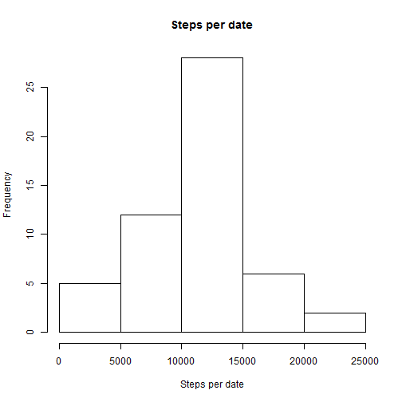
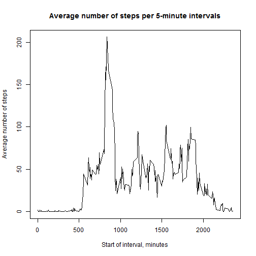
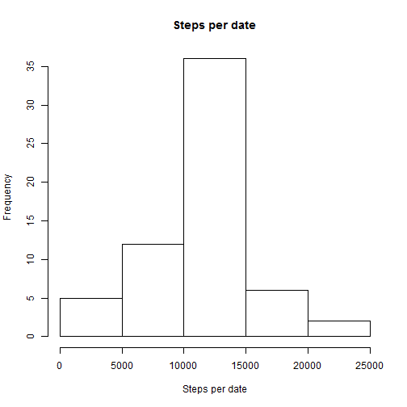
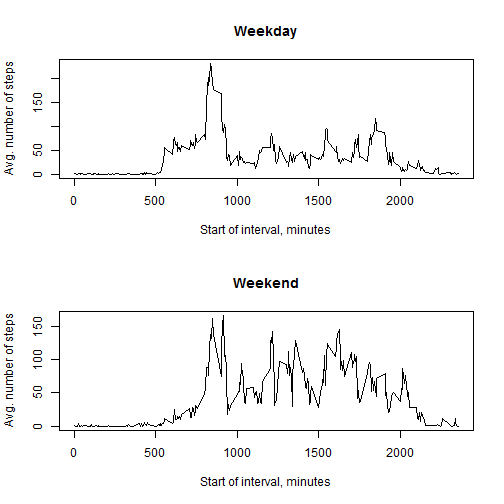

## Loading and preprocessing the data

Load data from local zip-file *activity.zip*

```r
unzip("activity.zip")
data <- read.csv("activity.csv")
```

Convert Date to POSIX format

```r
data$d <- strptime(data$date,"%Y-%m-%d")
```


## What is mean total number of steps taken per day?

Following code calculates the total number of steps taken per day and makes a histogram of the total number of steps taken each day.


```r
library(plyr)
steps_per_date <- aggregate(steps ~ date, data, sum)
hist(steps_per_date$steps, main="Steps per date", xlab="Steps per date")
```

 

Mean and median of the total number of steps taken per day are 10766.19 and 10765.

## What is the average daily activity pattern?

Following code calculates the average number of steps taken during 5-minute interval and make a time series plot of that data.


```r
library(plyr)
avg_steps_per_5min <- aggregate(steps ~ interval, data, mean)
with(avg_steps_per_5min, plot(interval, steps, type="l", 
                              main="Average number of steps per 5-minute intervals", 
                              xlab="Start of interval, minutes", ylab="Average number of steps"))
```

 

We use *which.max* to find 5-minute interval, on average across all the days in the dataset, containing the maximum number of steps. And we use POSIX datetime format to get readable format of the interval:


```r
idx_max <- which.max(avg_steps_per_5min$steps)
max_step_interval <- avg_steps_per_5min[idx_max,]
t1 <- as.numeric(max_step_interval[1]) * 60

t_start <- as.POSIXct(t1, origin="1970-01-01", tz="GMT")
t_end <- as.POSIXct(t1 + 5 * 60, origin="1970-01-01", tz="GMT")
```

Maximum number of steps on average is 206.1698, done between 13:55 and 14:00.

## Imputing missing values

There are 2304 missing values in the dataset. Lets fill missing data with average number of steps per 5-minute interval calculated above.


```r
data_tmp <- merge(data, avg_steps_per_5min, by.x = "interval", by.y = "interval")
empty <- is.na(data_tmp$steps.x)
data_tmp$steps[empty] <- data_tmp$steps.y[empty]
data_tmp$steps[!empty] <- data_tmp$steps.x[!empty]

data_filled <- data_tmp[,names(data)]
rm(data_tmp)
```

Lets compare new dataset with original one. Historgam of total number of steps in new dataset:

```r
library(plyr)
steps_per_date_new <- aggregate(steps ~ date, data_filled, sum)
hist(steps_per_date_new$steps, main="Steps per date", xlab="Steps per date")
```

 

Mean and median of the total number of steps taken per day are 10766.19 and 10766.19.

Though total number of steps per date is bigger then in original dataset (can be seen on the histogram), the mean is the same for both datasets, and there is a little differences in the median. It can be explained by method we used to add missing values. 

## Are there differences in activity patterns between weekdays and weekends?

Following code creates a new factor variable in the dataset with two levels - "weekday" and "weekend" indicating whether a given date is a weekday or weekend day. 


```r
weekend <- weekdays(data_filled$d) %in% c("Sunday", "Saturday")
data_filled$daytype[weekend] <- "weekend"
data_filled$daytype[!weekend] <- "weekday"
data_filled$daytype <- as.factor(data_filled$daytype)
```

Plot containing a time series plot of the 5-minute interval (x-axis) and the average number of steps taken, averaged across all weekday days or weekend days (y-axis):


```r
library(plyr)
avg_steps_per_5min <- aggregate(steps ~ interval + daytype, data_filled, mean)

par(mfrow = c(2, 1))

with(avg_steps_per_5min[avg_steps_per_5min$daytype == "weekday",], 
     plot(interval, steps, type="l", main="Weekday", 
          xlab="Start of interval, minutes", ylab="Avg. number of steps"))

with(avg_steps_per_5min[avg_steps_per_5min$daytype == "weekend",], 
     plot(interval, steps, type="l", main="Weekend", 
          xlab="Start of interval, minutes", ylab="Avg. number of steps"))
```

 
